# 智扫通机器人智能客服 Agent

这是一个面向扫地/扫拖机器人的 RAG + 多工具 Agent 项目，覆盖知识库问答、天气/环境适配、用户设备使用记录查询、个性化报告生成、工具注册、安全检查、会话记忆、可观测 trace、FastAPI 服务化和 Streamlit 演示界面。

## 功能

- RAG 知识库：从 `data/` 中的 PDF/TXT 构建 Chroma 向量库。
- 多工具 Agent：支持知识库检索、天气、用户位置、用户 ID、当前月份、使用记录和报告上下文切换。
- MCP 风格工具注册：导出工具 manifest，并通过 allowlist、`ToolPolicy` 和审批存储控制工具权限。
- 真 MCP 服务：支持 JSON-RPC `initialize`、`tools/list`、`tools/call`，可通过 stdio 或 HTTP 调用；敏感工具不会直接绕过审批。
- 可控数据服务：用户、城市、月份和天气从配置读取，避免随机输出。
- 显式工作流：报告生成走 `ReportWorkflow`，减少纯 Prompt 编排的不确定性。
- 安全与可观测：提示词注入拦截、RAG 注入检测、工具参数校验、敏感字段脱敏、请求/工具/RAG trace、OpenTelemetry 风格 span。
- Harness 控制层：统一 `AgentRunner`/`AgentState`，支持预算停止、动态工具策略、真实审批、答案验证、artifact 存储和诊断 trace。
- 服务端能力：API Key 鉴权、限流、SQLite 会话/trace 持久化、缓存/任务队列抽象。
- 服务化交付：FastAPI API、Streamlit UI、Dockerfile、CI 和 pytest 测试。

## 环境

推荐 Python 3.10.x，本项目使用 Python 3.10.11 验证。

```powershell
python -m venv .venv
.\\.venv\\Scripts\\Activate.ps1
python -m pip install -U pip
pip install -e ".[dev]"
Copy-Item .env.example .env
```

在 `.env` 中配置 `DASHSCOPE_API_KEY`。

## 启动

加载知识库：

```powershell
python -m rag.vector_store
```

启动 Streamlit 演示：

```powershell
streamlit run app.py
```

启动 FastAPI 服务：

```powershell
uvicorn api.server:app --host 0.0.0.0 --port 8000
```

常用接口：

- `GET /health`
- `GET /tools/manifest`
- `POST /chat`
- `POST /chat/stream`
- `POST /harness/run`
- `GET /approvals/{approval_id}`
- `POST /approvals/{approval_id}/approve`
- `POST /approvals/{approval_id}/deny`
- `GET /artifacts/{request_id}`
- `GET /artifact/{artifact_id}`
- `POST /mcp`
- `GET /traces/{request_id}`
- `GET /traces/{request_id}/otel`

入口关系：

- `/harness/run` 是推荐的生产入口，返回 `status`、`approval_id`、artifact 和 verifier 结果。
- `/chat` 保留兼容旧调用方，但内部已经调用 `AgentRunner`，不会绕过审批、artifact、trace 和 verifier。
- `/chat/stream` 是 SSE 外观接口，当前以 harness 最终结果发送 `answer/done` 事件，不再直接跑旧 ReAct stream。
- `/mcp tools/call` 由 `MCPToolServer` 先经过 `ToolPolicy`；调用 `fetch_external_data` 这类敏感工具时会返回 `pending_approval` 和 `approval_id`，审批通过且参数匹配后才执行。
- `user_role` 不再信任请求 body，服务端从 `X-User-Role` 这类 auth header 中解析；`approve/deny` 需要 `operator` 或 `admin`。

启动 MCP stdio server：

```powershell
python mcp_server.py
```

## 测试与评测

```powershell
python -m pytest tests -q
python scripts/evaluate_rag.py
python scripts/evaluate_agent.py --dry-run
python scripts/evaluate_agent.py --mode harness --gate --report storage/agent_eval_report.json
python scripts/benchmark_api.py --url http://127.0.0.1:8000/chat --api-key dev-api-key
```

`evals/rag_golden.jsonl` 包含 50+ 条 RAG golden set，用于输出 recall@k、MRR、引用命中率、幻觉率代理指标，并比较 top-k、hybrid、rerank 策略。

## 部署

```powershell
docker build -t sweeper-agent .
docker run --env-file .env -p 8000:8000 sweeper-agent
```
---

# 2. 总体架构图

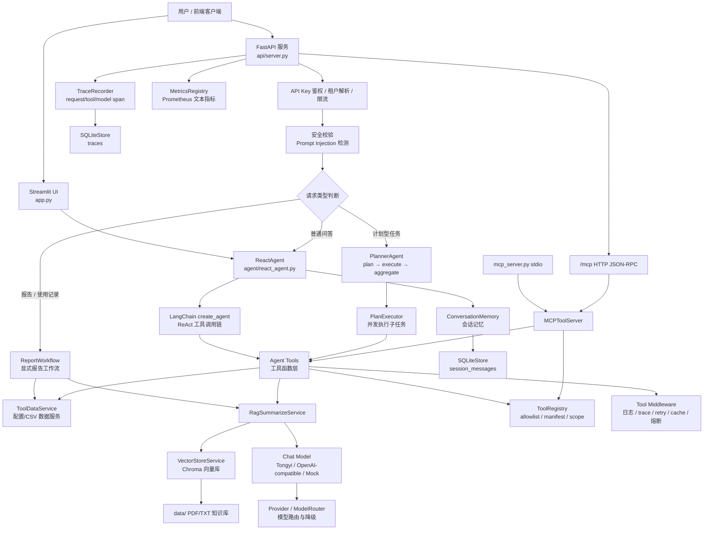

---

# 3. 分层架构说明

## 3.1 表现层：Streamlit + FastAPI

项目有两个入口。

第一个是 `app.py`，用于 Streamlit 演示界面。它在 `st.session_state` 中维护 `ReactAgent`、消息列表和 `session_id`，用户输入后调用 `ReactAgent.execute_stream()` 进行流式回答。

第二个是 `api/server.py`，用于 FastAPI 服务化交付。服务中初始化了 `SQLiteStore`、`ReactAgent`、`AgentRunner`、`RateLimiter` 和 `MCPToolServer`，并暴露 `/health`、`/tools/manifest`、`/chat`、`/chat/stream`、`/harness/run`、`/approvals/*`、`/artifacts/{request_id}`、`/artifact/{artifact_id}`、`/plan`、`/judge`、`/traces/{request_id}`、`/mcp` 等接口。

---

## 3.2 接入与控制层：鉴权、限流、租户、安全

FastAPI 的 `/chat`、`/chat/stream`、`/harness/run` 和 HTTP `/mcp` 都会先做 API Key 鉴权，再从 header/auth context 解析 `tenant_id/user_role/principal_id`，然后按租户或 IP 维度限流，最后进行用户输入安全检查。body 中的 `user_role` 只保留兼容字段，生产控制不信任它。

限流器是一个轻量滑动窗口实现，用 `deque` 记录请求时间，超过窗口内最大请求数后拒绝。

安全层主要在 `safety/security.py` 和 `safety/auth.py`，包括用户 Prompt Injection 检测、RAG 检索内容注入检测、工具参数正则校验、敏感工具 approval context、日志脱敏和可信角色解析。

---

# 4. Agent 主链路架构

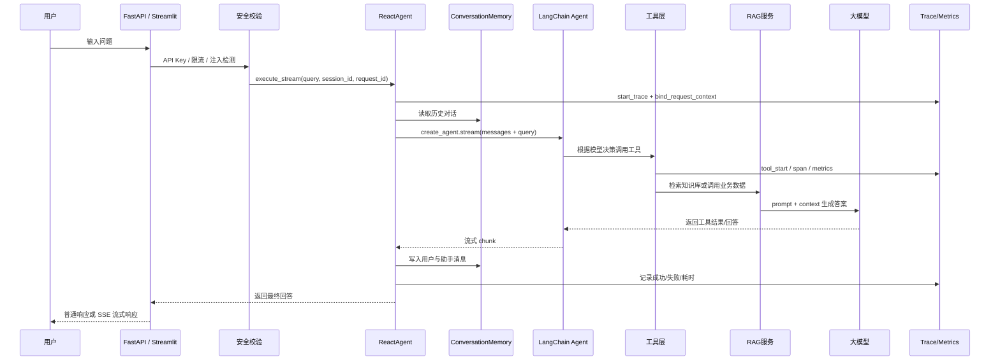

`ReactAgent` 是 Agent 主入口。它创建 LangChain Agent，加载系统 Prompt，注册工具，并接入中间件。工具包括 RAG 总结、天气、用户位置、用户 ID、当前月份、外部使用记录、报告上下文切换等。

执行时，`ReactAgent.execute_stream()` 会启动 trace，绑定 `request_id/session_id/tenant_id` 上下文，做安全校验，读取会话历史，把历史消息和当前用户问题组成输入，再调用 `self.agent.stream()` 获取模型与工具调用结果。成功后会把本轮用户消息和助手回答写入记忆。

---

# 5. 工具层架构

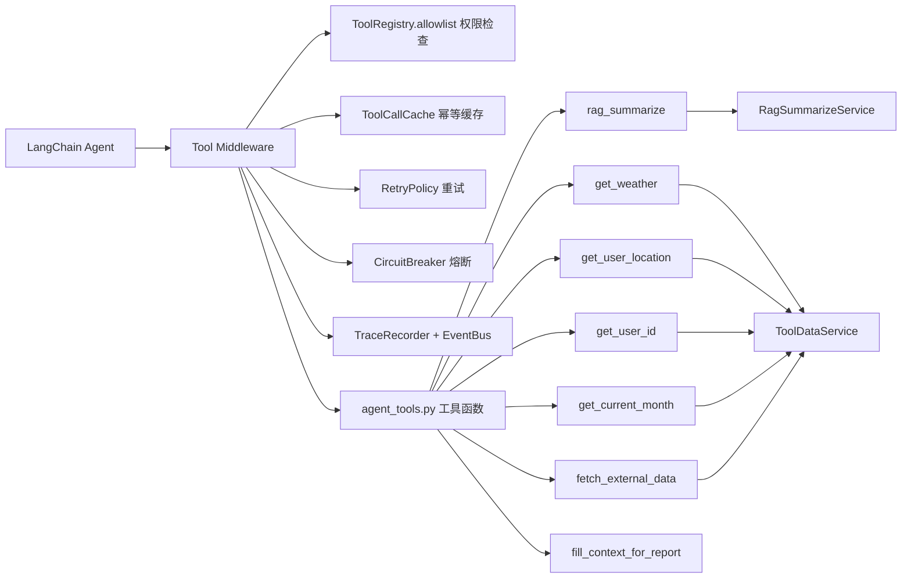

工具函数集中在 `agent/tools/agent_tools.py`。其中 `rag_summarize` 调用 RAG 服务，`get_weather/get_user_location/get_user_id/get_current_month/fetch_external_data` 调用 `ToolDataService`，并且每个工具入口都会先检查 allowlist 和参数安全。

工具注册表 `ToolRegistry` 记录每个工具的名称、描述、scope 和 input schema，既能做权限控制，也能导出 MCP 风格 manifest。

默认注册的工具包括 `rag_summarize`、`get_weather`、`get_user_location`、`get_user_id`、`get_current_month`、`fetch_external_data` 和 `fill_context_for_report`。

工具中间件负责工具调用的工程控制：先做 allowlist 和 `ToolPolicy` 检查，再接入审批、超时、熔断器、trace span、SSE 事件、缓存、重试、指标统计。trace 中不保存原始工具参数，只保存 `args_hash` 和 `redacted_args`。如果敏感工具没有审批，会返回 `pending_approval`/拒绝类 `ToolMessage`，不会直接 invoke 原始工具函数。

---

# 6. RAG 知识库架构

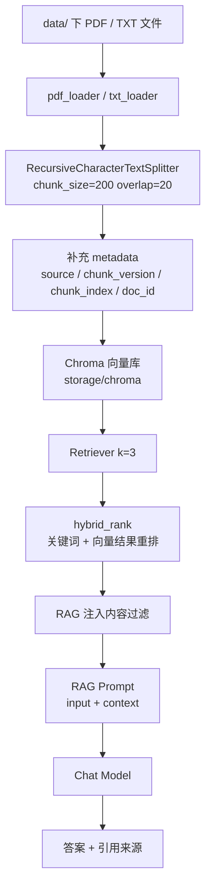

RAG 加载流程由 `VectorStoreService` 实现：读取 `data/` 下允许的 PDF/TXT 文件，计算 MD5 去重，加载文档，切分 chunk，补充 metadata，然后写入 Chroma 向量库。

Chroma 配置中，collection 名为 `agent`，持久化目录是 `storage/chroma`，默认检索 `k=3`，数据目录是 `data`，允许文件类型是 `txt/pdf`，chunk 大小为 200，overlap 为 20。

RAG 问答由 `RagSummarizeService` 实现：先从向量库检索，再经过 `hybrid_rank` 重排，对检索内容做 RAG 注入检测，最后将 query 和 context 填入 RAG prompt 调用模型，并在答案后附加引用来源。

---

# 7. 报告生成工作流架构

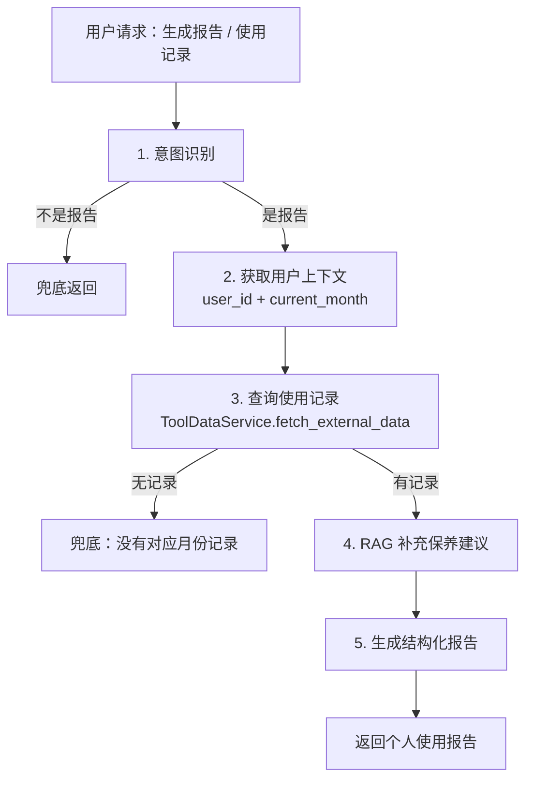

报告生成不是完全依赖 Prompt，而是由 `ReportWorkflow` 显式编排。流程包括：识别是否为报告意图、加载用户 ID 和月份、查询外部使用记录、RAG 补充保养建议、生成最终报告；如果不是报告意图或查不到记录，会进入 fallback。

具体字段来自 `ToolDataService`，它从配置中读取默认用户 ID、位置、当前月份和天气配置，并从 CSV 中读取外部使用记录。

当前配置中默认用户 ID 是 `1005`，默认位置是合肥，当前月份是 `2025-09`，并允许全部核心工具。

---

# 8. Planner 多任务架构

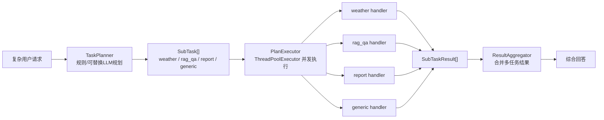

`agent/planner.py` 实现了 `plan → execute → aggregate` 模式，用于处理多步骤任务。`TaskPlanner` 会把请求拆成 `weather/rag_qa/report/generic` 等子任务，`PlanExecutor` 可用线程池并发执行无依赖子任务，`ResultAggregator` 再把多个子任务结果合并为最终回答。

在 `ReactAgent` 中，Planner 的 handler 分别对接天气、RAG、报告工作流和默认 Agent 链路。

---

# 9. MCP 架构

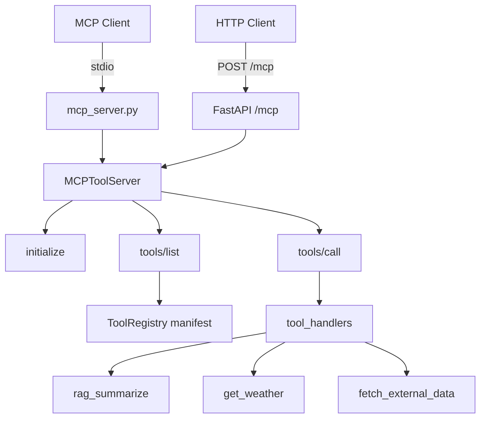

MCP 适配层由 `MCPToolServer` 实现，支持 JSON-RPC 的 `initialize`、`tools/list` 和 `tools/call`。`tools/list` 返回工具 manifest，`tools/call` 会先执行 `ToolPolicy`，只有 allow 或审批通过后才调用对应 handler。

项目同时支持 stdio MCP 和 HTTP MCP。`mcp_server.py` 从标准输入逐行读取 JSON-RPC 请求，然后输出 JSON-RPC 响应；FastAPI 中的 `/mcp` 端点则调用同一套 `MCPToolServer.handle_jsonrpc()`，并传入 auth context。敏感工具返回示例：`{"status":"pending_approval","approval_id":"..."}`。

---

# 10. 模型层架构

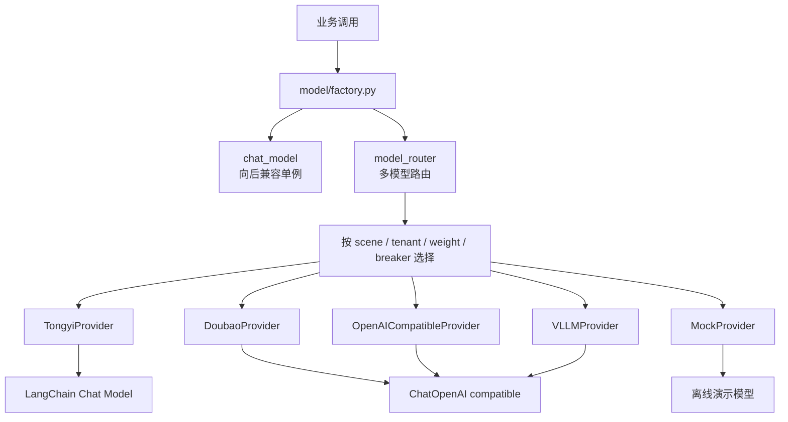

模型工厂目前保留 `chat_model` 模块级单例，向后兼容原有代码；同时新增 `model_router`，用于后续按健康度和租户路由模型，实现主模型不可用时自动降级。

Provider 抽象支持 `mock`、`tongyi`、`openai_compatible`、`doubao`、`vllm`。其中豆包和 vLLM 都复用 OpenAI-compatible 接口，只是 base_url 和 API key 环境变量不同。

`ModelRouter` 按 scene、tenant、weight 和 CircuitBreaker 健康度选择 provider；调用失败后记录失败并尝试降级到下一个候选模型。

---

# 11. 会话记忆与持久化架构

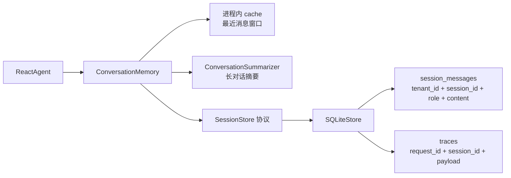

`ConversationMemory` 同时支持进程内缓存和可插拔持久化后端，默认可接 SQLite；它通过 `tenant_id|session_id` 形成多租户会话 key，并在消息超过阈值时可触发摘要压缩。

`SQLiteStore` 创建两张核心表：`session_messages` 保存会话消息，`traces` 保存请求链路追踪 payload，并为 tenant/session 维度建立索引。

---

# 12. 可观测性架构

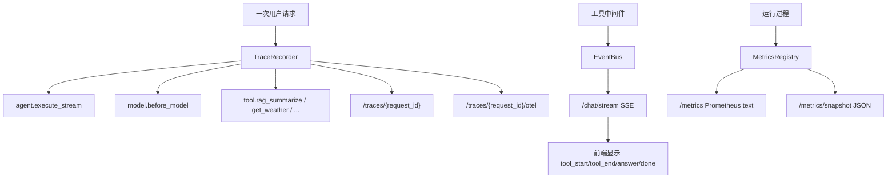

`TraceRecorder` 能记录 request、agent、tool、model 等 span，每个事件包括 category、name、started_at、duration_ms、metadata 和 error，并能导出 OpenTelemetry 风格 span。诊断事件会包含 step_id、status、tool、evidence_ids、verifier、retry、prompt_version、model_name、failure_reason、tokens/cost。

`EventBus` 是请求级事件总线，工具中间件在工具调用前后发布 `tool_start/tool_end`，SSE 端点消费同一个 `request_id` 的事件，从而让前端知道 Agent 正在调用哪个工具。

`MetricsRegistry` 是无外部依赖的内存指标注册器，支持 counter、gauge、histogram，并能导出 Prometheus 文本格式；指标包括请求量、请求延迟、工具调用量、工具延迟、RAG 评测分数和 token 统计。

---

# 13. 缓存、重试、熔断架构

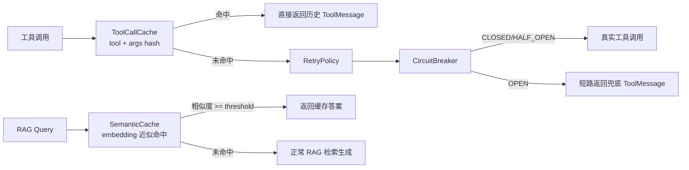

缓存层包括 TTL+LRU 的 `MemoryCache`、基于 embedding 余弦相似度的 `SemanticCache`、以及工具调用幂等缓存 `ToolCallCache`。RAG 服务会在启用 embedding 时使用语义缓存，相似问题可直接返回缓存答案。

熔断器实现了 `CLOSED → OPEN → HALF_OPEN → CLOSED` 三态，用于模型、工具和外部依赖保护。连续失败达到阈值后进入 OPEN，恢复时间后允许半开探测。

---

# 14. 目录结构与职责

| 目录 / 文件            | 职责                                                      |
| ------------------ | ------------------------------------------------------- |
| `app.py`           | Streamlit 聊天演示入口                                        |
| `api/`             | FastAPI 服务入口，提供 chat、stream、MCP、trace、metrics、judge 等接口 |
| `agent/`           | Agent 主体、会话记忆、Planner、Summarizer、Workflow               |
| `agent/tools/`     | LangChain 工具、工具注册表、中间件、重试策略                             |
| `agent/workflows/` | 显式业务工作流，目前核心是个人使用报告生成                                   |
| `rag/`             | Chroma 向量库、RAG 检索总结、引用、评测辅助                             |
| `model/`           | 模型工厂、Provider 抽象、多模型路由                                  |
| `services/`        | 数据服务、SQLite 持久化、缓存、限流、任务队列、熔断器                          |
| `safety/`          | Prompt 注入检测、RAG 注入检测、工具参数校验、脱敏                          |
| `observability/`   | trace、metrics、事件总线、请求上下文                                |
| `mcp_adapter/`     | MCP JSON-RPC 适配层                                        |
| `config/`          | Agent、RAG、Chroma、Prompt 配置                              |
| `data/`            | 知识库文件和外部使用记录数据                                          |
| `docs/`            | demo 说明、面试讲稿、Harness 讲稿和架构说明                            |
| `tests/`           | 单元测试、Prompt 回归、安全、MCP、RAG 等测试                           |
| `evals/`           | RAG/Agent golden set 评测数据                               |

README 对目录职责也做了概括：`agent/` 是 Agent、工具、中间件、会话记忆；`api/` 是 FastAPI 服务；`rag/` 是向量库和 RAG；`services/` 是数据服务适配器；`safety/` 是安全；`observability/` 是 trace；`mcp_adapter/` 是 MCP JSON-RPC 适配层。

---

# 15. 典型请求链路

## 15.1 普通知识库问答

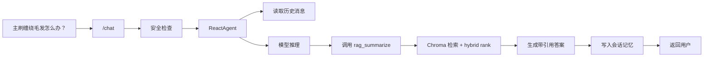

演示文档中给出的普通客服问答示例是 `/chat` 接口收到“主刷缠绕毛发怎么办？”，预期先进入 `AgentRunner`，再调用 ReAct 后端；必要时调用 RAG 工具，并返回带引用来源的处理建议。

## 15.2 个人使用报告

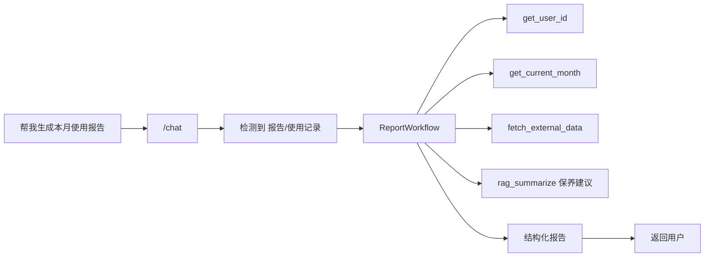

`/chat` 和 `/harness/run` 中如果检测到消息包含“报告”或“使用记录”，会先由 `AgentRunner` 判断是否需要 `fetch_external_data`。普通用户会得到 `pending_approval`，operator/admin 或审批通过后才继续执行后端；因此报告链路不会绕过敏感工具审批。

---

# 16. 启动与部署架构

本地启动顺序一般是：先安装依赖，再配置 `.env`，加载知识库，最后启动 Streamlit 或 FastAPI。README 给出的命令包括 `python -m rag.vector_store` 加载知识库，`streamlit run app.py` 启动演示，`uvicorn api.server:app --host 0.0.0.0 --port 8000` 启动服务。

`.env.example` 中包含 DashScope Key、默认用户、默认城市、当前月份、模型 provider、模型名、embedding 模型名、允许工具、trace 开关、API Key、SQLite 路径和限流配置。

Dockerfile 使用 `python:3.10-slim`，复制项目核心目录，安装当前包，并以 `uvicorn api.server:app --host 0.0.0.0 --port 8000` 作为容器启动命令。

---

# 17. 这个项目的核心亮点

第一，**业务链路不是纯 Prompt**。普通问答走 ReAct Agent，报告生成走 `ReportWorkflow` 显式流程，避免高确定性业务完全依赖模型自由发挥。

第二，**工具体系工程化**。工具有注册表、scope、input schema、allowlist、参数校验、中间件、trace、缓存、重试和熔断，不是简单写几个 Python 函数。

第三，**RAG 有完整闭环**。它包括文档加载、MD5 去重、chunk 切分、metadata、Chroma 存储、检索、hybrid rank、RAG 注入过滤、引用来源和评测集。

第四，**具备服务化交付能力**。FastAPI 提供 API Key 鉴权、限流、SSE、MCP、trace、metrics、judge 等接口，Dockerfile 支持容器化部署。

第五，**可观测性较完整**。项目有 request_id、session_id、trace span、OTel 风格导出、Prometheus 文本指标、SSE 事件总线，可以定位单次请求中模型、工具、RAG 哪一步慢或失败。

---

# 18. 可以放进文档里的简化版架构图

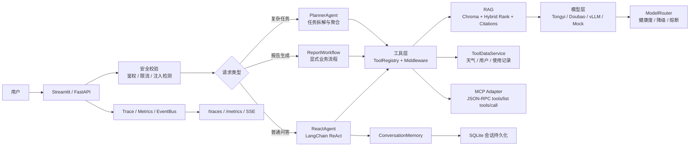

