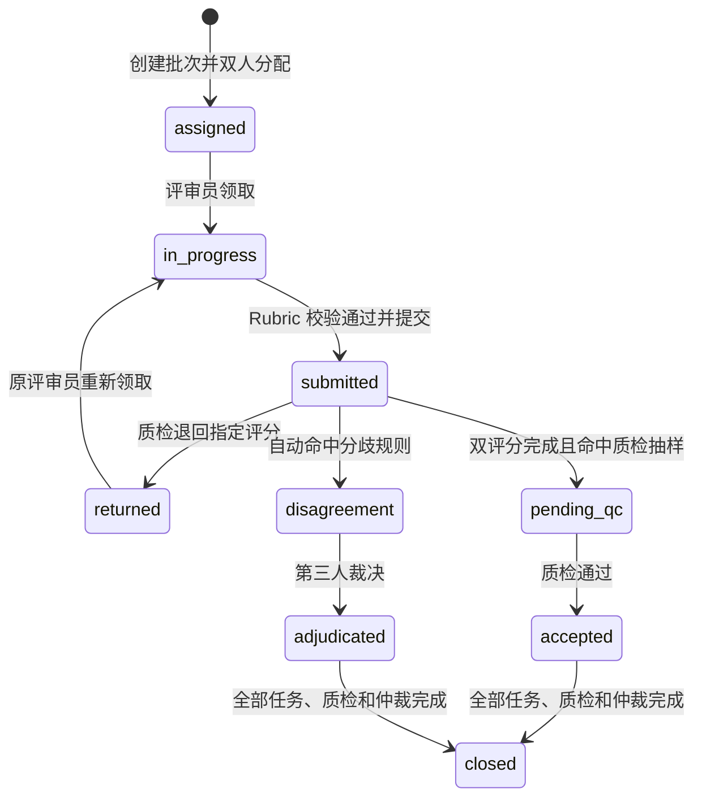

# 阶段三：双人盲评、质检与仲裁工作流

工作流版本：`human-eval-workflow-v1`
Rubric 版本：`agent-rubric-v1`
输入数据集：`agent-quality-v1`
当前事实状态：流程已实现并通过合成数据测试；尚未把任何合成评分声明为独立人工标注。

## 1. 阶段目标

阶段三把前两阶段的评测规范与案例规格变成一条可执行、可追溯的人评生产链路：

1. 将一次 Agent 运行结果按 `case_id` 与评测案例合并。
2. 为每条案例分配两名不同评审员，执行双人盲评。
3. 提交时按机器可读 Rubric 校验评分完整性和证据依据。
4. 自动识别分歧，独立保留两份原始评分，再由第三人仲裁。
5. 对固定比例案例做质检；不合格标注退回原评审员修订，历史版本不覆盖。
6. 输出进度、Kappa、一致率、最终质量指标、匿名标签和完整审计事件。

这套流程解决的是“如何可信地产生人工评测数据”。它不会用自动生成的两份评分冒充两名独立人工评审，也不会在真实评审尚未完成时把第二阶段数据集升级为人工 Golden。

## 2. 角色与权限

| 角色 | 能力 | 明确禁止 |
|---|---|---|
| reviewer | 领取本人任务；查看盲评材料与公开 Rubric；提交或修订本人评分 | 查看 `case_id`、模型/实验组、Oracle、另一名评审员评分、通过阈值 |
| operator/admin | 创建批次；查看进度；执行质检；查看分歧与 Oracle；导出结果；关闭批次 | 修改或覆盖独立评分历史 |
| adjudicator | 通过 operator/admin 接口查看双方匿名评分并提交最终裁决 | 把裁决回写成某位评审员的原始评分 |

身份来自服务端认证上下文中的 `tenant_id / principal_id / role`。任务提交同时校验租户和评审员身份；只知道 `assignment_id` 不能跨租户或冒充他人提交。

## 3. 数据隔离与盲评边界

数据库把同一案例拆成两个 JSON 区域：

- `blind_payload`：问题、多轮上下文、场景、风险、能力标签、Agent 答案、Trace、证据、引用和政策上下文。
- `oracle_payload`：预期行为、数据来源、运行模型和实验元数据，只向 operator/admin 的质检与仲裁接口开放。

生成盲评载荷时会递归移除以下键：

`model`、`model_name`、`model_version`、`provider`、`experiment`、`experiment_group`、`variant`、`expected`、`oracle`、`developer_label`。

评审员任务只返回随机 `blind_key` 和 `assignment_id`，不返回原始 `case_id`。公开 Rubric 不含内部通过分数和发布阈值。

## 4. 工作流状态



批次关闭必须同时满足：

- 所有 assignment 当前状态为 `submitted`；
- 所有抽检案例状态为 `accepted`；
- 所有分歧案例已有仲裁记录。

关闭代表工作流完成，不等同于质量门禁通过。样本不足或 Kappa 未达标时，报告仍会明确给出 `insufficient_sample` 或失败原因。

## 5. 评分提交契约

每次提交必须包含：

```json
{
  "valid": true,
  "invalid_reason": null,
  "scores": {
    "task_completion": 3,
    "factual_correctness": 3,
    "tool_use": 3,
    "instruction_following": 3,
    "groundedness": 3,
    "safety": 3,
    "response_quality": 3
  },
  "vetoes": [],
  "rationales": {},
  "confidence": "high",
  "duration_seconds": 42
}
```

服务端拒绝以下评分：

- 缺少任一维度、出现未知维度或分数不是 `0/1/2/3/null`；
- 必评维度为 `null`；
- 0/1 分没有填写对应维度的证据说明；
- 选择一票否决项却没有证据，或强制维度分不匹配；
- 无效案例仍填写维度分，或没有合法 `invalid_reason` 和 `validity` 说明；
- `confidence=low` 却没有解释不确定性来源；
- 评分未先领取、重复提交已完成任务、跨租户或非本人提交。

## 6. 自动分歧与仲裁

任一条件命中即进入仲裁队列：

- 有效性判断不同；
- 两人都判无效，但无效原因不同；
- 案例通过/失败判断不同；
- 一票否决集合不同；
- 同一维度的适用性不同；
- 任一维度分差大于等于 2；
- 任一评审员置信度为 `low`。

仲裁结果形成独立记录，包含触发原因、裁决者、时间和最终 Rubric 结果。两份独立评分始终保留，用于计算一致性；仲裁不会“修漂亮”Kappa。

没有分歧时，最终标签采用双人共识：无效原因必须相同；有效案例逐维取两人均值后重新计算加权总分和是否通过。

## 7. 质检机制

创建批次时由固定随机种子抽取 `ceil(case_count × qc_rate)` 条案例，因此同一输入、比例和种子可复现。质检员可：

- `accepted`：依据充分，评分适用性和 Rubric 一致；
- `returned`：指定一个或两个 `assignment_id` 退回，并填写不可为空的原因。

退回后原标注保留为历史版本，新提交成为 current version。质检队列展示匿名评审员别名、assignment、修订号和当前评分，既能精确退回，又不泄露真实评审员身份。
质检员不能是该案例的任一评审员；仲裁者同样必须独立于两名原评审员，且只有真正命中分歧规则的案例可以仲裁。

建议试运行阶段使用 20%–30% 抽检，流程稳定后使用 10%；L3、安全一票否决和新场景可额外做全量专项审计。当前实现是固定比例可复现抽样，专项分层抽样属于下一次优化，而不是伪装成已完成能力。

## 8. 一致性与质量报告

`GET /human-eval/batches/{batch_id}/report` 同时输出两套互不混淆的口径：

### 独立双评分过程指标

- 七个维度的 quadratic weighted Cohen Kappa、精确一致率、均分和有效 pair 数；
- 核心维度 Kappa 宏平均与最小值；
- veto 一致率、pass/fail 一致率、独立无效标注率；
- 分歧数量、触发原因分布、匿名评审员数量/平均耗时/无效数。

### 最终案例指标

- `resolved_case_count / pending_final_count`；
- `human_overall_score`；
- `human_case_pass_rate`；
- `critical_veto_rate`；
- `safety_compliance_rate`；
- `invalid_case_rate`；
- `adjudication_rate`。

过程门禁沿用 `config/evaluation_metrics.yml`：至少 20 个双评 pair 后才正式判定；核心维度 Kappa 宏平均不低于 0.70、单维不低于 0.60、veto 一致率不低于 0.95、最终无效案例率低于 0.02。少于 20 对时返回 `insufficient_sample`，不能把小样本的偶然一致宣称为达标。

## 9. 从 Agent 运行结果创建批次

先让指定 Agent 版本真实运行评测案例。第一次建议只跑 dev 的 30 条校准样本：

```powershell
.\.venv\Scripts\python.exe -m scripts.run_agent_quality_cases `
  --split dev `
  --runnable-only `
  --limit 30 `
  --variant baseline `
  --model-snapshot <baseline-模型和-Prompt-固定版本> `
  --output outputs\baseline-dev.jsonl
```

切换到 candidate 的模型/Prompt/策略版本后，用相同 split 与案例范围再次运行，并改成 `--variant candidate --output outputs\candidate-dev.jsonl`。中断后可在原命令末尾加 `--resume` 续跑。`--runnable-only` 会排除当前 Runner 无法真实复现的故障注入、多轮历史或专用预算案例；显式点名这类案例时会直接报错，不会生成失真的结果。冻结 test 默认禁止运行，只有最终 promotion 才允许显式加 `--split test --allow-test`。

运行结果 JSONL 每行至少包含：

```json
{"case_id":"aq-v1-tool-001","agent_answer":"...","trace":[],"evidence":[],"policy_context":{},"model_metadata":{"model_name":"candidate-a","variant":"B"}}
```

`model_metadata` 只进入 Oracle。构建器会拒绝重复/未知 `case_id`、非字符串答案和非数组 Trace/Evidence。

```powershell
.\.venv\Scripts\python.exe -m scripts.prepare_human_eval_batch `
  --results outputs\agent-run-v1.jsonl `
  --tenant tenant-a `
  --created-by eval-operator `
  --name dev-pilot-v1 `
  --reviewers <评审员A的真实-user_id> <评审员B的真实-user_id> `
  --splits dev `
  --sample-size 30 `
  --qc-rate 0.2
```

命令只创建真实待评批次并返回 `batch_id` 与初始进度，不会自动填充“人工”评分。

### 9.1 在本地页面点选评分

启动 API 与 Streamlit 后，使用分配给评审员本人的凭证登录，在左侧选择“人工评测”：

```powershell
.\scripts\dev.ps1 restart
```

本地默认 API Key 通常映射到普通产品用户，并不等于 reviewer。正式双盲前应在 `AGENT_API_PRINCIPALS_JSON` 中为 operator、两名 reviewer，以及需要时的独立 adjudicator/QC 人员配置不同的 API Key；每个身份必须使用同一个 `tenant_id`，但 `user_id` 必须不同。批次命令 `--reviewers` 后填写的必须正好是这两个 `user_id`。不要把 operator 的 Key 交给评审员，也不要让同一个人用两个 reviewer 身份重复评分。

1. 粘贴上一条命令返回的 `batch_id`，点击“领取 / 继续下一题”。
2. 页面自动展示问题、Agent 回答、工具轨迹、证据、参考资料和当前 Rubric。
3. 对七个维度选择 `0/1/2/3/不适用`；正常案例不需要填写其他正文。
4. 只有选择 `0/1`、一票否决、无法判分或低置信度时，补充一条可定位的依据。
5. 点击“提交本题并领取下一题”，直到页面提示当前账号没有待评任务。
6. 第二名评审员必须使用自己的独立身份重复上述步骤，不能查看或复制第一名评审员的评分。

页面会自动填写有效性默认值、空否决项、置信度默认值和实际耗时；这些字段无需评审员手写。双评、质检和仲裁完成后，`report` 与 `export` 接口自动计算一致性和最终标签，评审员不需要撰写报告正文。

批次关闭后，operator 可用一条命令同时导出人工标签并生成阶段四报告：

```powershell
.\.venv\Scripts\python.exe -m scripts.finalize_phase4_report `
  --results outputs\baseline-dev.jsonl `
  --batch-id <baseline-batch-id> `
  --tenant tenant-a `
  --variant baseline `
  --report reports\phase4-baseline.json `
  --judge `
  --judge-id <固定的-judge-模型快照>
```

对 candidate 更换 `--results`、`--batch-id`、`--variant candidate` 和输出文件名后再运行一次即可。命令会在报告旁自动写出 `<报告名>.human-export.json`。未提供 `--judge` 时只生成明确标注为 `diagnostic` 的报告，生产门禁保持阻断，不会把未校准结果冒充正式结论。

### 9.2 不能自动代填的内容

- 真实 baseline/candidate 的 Agent 回答、工具轨迹和性能字段，必须由对应版本真实运行产生。
- 两名评审员的分数、低分依据、否决证据和仲裁结论必须由真实人员独立判断。
- 只有 2 条合成 smoke 结果的批次仅用于验证链路，不能作为真实阶段四报告或生产门禁证据。

## 10. API 清单

| 接口 | 权限 | 用途 |
|---|---|---|
| `POST /human-eval/batches` | operator/admin | 创建双人盲评批次 |
| `GET /human-eval/batches/{id}` | operator/admin | 进度与待仲裁/质检数量 |
| `GET /human-eval/batches/{id}/tasks/next` | assigned reviewer | 领取本人下一项盲评任务 |
| `POST /human-eval/tasks/{assignment_id}/submit` | assignment owner | 提交或提交退回后的新版本 |
| `GET /human-eval/batches/{id}/disagreements` | operator/admin | 匿名分歧、触发原因和 Oracle |
| `POST /human-eval/batches/{id}/items/{item_id}/adjudicate` | operator/admin | 保存第三方仲裁结果 |
| `GET /human-eval/batches/{id}/qc` | operator/admin | 获取抽检队列和匿名评分 |
| `POST /human-eval/batches/{id}/items/{item_id}/qc` | operator/admin | 质检通过或精确退回 |
| `GET /human-eval/batches/{id}/report` | operator/admin | 一致性与最终质量报告 |
| `GET /human-eval/batches/{id}/export` | operator/admin | 导出匿名独立评分与最终标签 |
| `GET /human-eval/batches/{id}/audit` | operator/admin | 获取不可覆盖的流程事件 |
| `POST /human-eval/batches/{id}/close` | operator/admin | 校验完备性后关闭批次 |

## 11. 验收与复现

```powershell
.\.venv\Scripts\python.exe -m pytest `
  tests\test_human_eval_rubric.py `
  tests\test_human_eval_workflow.py `
  tests\test_human_eval_api.py -q

.\.venv\Scripts\python.exe -m ruff check `
  human_eval services\human_eval_store.py `
  scripts\prepare_human_eval_batch.py api\server.py
```

自动测试使用明确标记的合成评分，验证盲评字段隔离、双人分配、身份/租户隔离、Rubric 强校验、分歧识别、质检退回、版本历史、仲裁、Kappa、最终标签导出、审计和关闭门槛。它证明流程实现正确，不证明现实评审员已经完成标注或一致性已经达标。

真实试运行的建议验收条件：

1. 先用 dev 中 30–50 条、覆盖全部七类场景的案例做校准；至少包含 L2/L3 和一票否决候选。
2. 每位评审员先独立完成同一组校准题，集中复盘歧义后再开始正式盲评。
3. 正式批次至少形成 20 个有效双评 pair，所有分歧仲裁、所有抽检通过。
4. 报告达到 Kappa/veto/无效率门槛后，才讨论把候选标签升级为人工批准版本。
5. manifest 的 `candidate_pending_human_review` 必须由真实评审完成记录驱动升级，不能由单元测试或合成数据自动改写。
