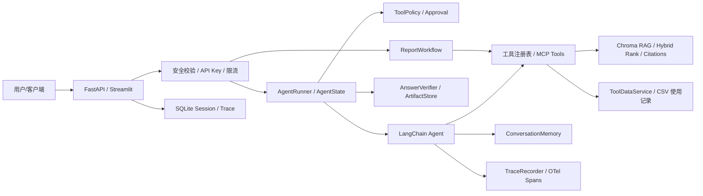

# Agent 项目面试讲稿

## 三轮改造总览

第一轮是课程 Demo 阶段：项目只有 Streamlit、LangChain Agent、Chroma RAG、几个模拟工具和提示词驱动的报告生成，能演示但不容易复现，也缺少测试、部署、安全和观测。

第二轮是工程化基础改造：我补了 Python 3.10 环境、`pyproject.toml`、`.env.example`、`.gitignore`、Dockerfile、CI、README、FastAPI、单元测试、工具注册、MCP 风格 manifest、会话记忆、安全拦截、trace、RAG 引用和评测脚本。这个阶段解决的是“别人能不能跑起来、能不能验证、能不能看懂边界”。

第三轮是生产就绪补强：我补了真正的 MCP JSON-RPC stdio/HTTP server、50+ RAG golden set 和指标、显式 ReportWorkflow、API Key 鉴权、限流、SQLite 持久化、模型 provider 降级、OpenTelemetry 风格 span、RAG 注入检测、工具参数校验、benchmark 脚本、demo 文档和这份面试讲稿。这个阶段解决的是“能不能对标真实 Agent 应用岗的工程要求”。

第四轮是 Harness 控制层补强：我补了统一 `AgentRunner`、`AgentState`、预算停止、动态工具策略、真实审批 API、答案验证闭环、artifact 存储、诊断级 trace、模型 router 接入和 Agent eval gate。这个阶段解决的是“Agent 能不能被平台化控制、暂停、验证、复盘和门禁发布”。

## 架构图

## 核心代码讲解

`agent/react_agent.py` 是 Agent 主入口。它把历史会话传给模型，执行前做安全检查，执行过程中写 trace，最后把用户和助手消息写入内存。

`agent/tools/agent_tools.py` 是工具层。原来用户、城市、月份都是随机的，现在改成 `ToolDataService` 配置驱动，并在工具入口做 allowlist、参数校验和敏感工具确认。

`agent/tools/registry.py` 是工具注册中心。它记录每个工具的名称、描述、scope 和 input schema，可以导出 MCP 风格 manifest，也可以在中间件里做权限检查。

`mcp_adapter/server.py` 和 `mcp_server.py` 是真正的 MCP 入口。它支持 JSON-RPC 的 `initialize`、`tools/list`、`tools/call`，可以通过 stdio 被 MCP 客户端拉起，也可以通过 `/mcp` 走 HTTP 调用。

`agent/workflows/report_workflow.py` 把报告生成从纯 Prompt 约束改成显式工作流：意图识别、用户上下文、记录查询、RAG 补充、报告生成、失败兜底。这样面试时可以说明“关键业务流程不用完全赌模型自觉”。

`rag/rag_service.py`、`rag/rag_utils.py` 和 `rag/evaluation.py` 是 RAG 改造核心。项目现在有 source metadata、chunk version、引用来源、hybrid rank、RAG 注入过滤和评测指标。

`api/server.py` 是服务化入口。它包含 `/health`、`/chat`、`/tools/manifest`、`/mcp`、`/traces/{id}` 和 `/traces/{id}/otel`，并接入 API Key、限流、SQLite trace/session 持久化。

`observability/tracing.py` 是轻量 trace。它能记录 request、tool、model、agent span，并导出 OpenTelemetry 风格结构，为后续接入 Jaeger/Tempo/云厂商 APM 留了接口。

`safety/security.py` 是安全边界。它覆盖用户 prompt injection、RAG 内容注入、工具参数校验、敏感字段脱敏和敏感工具确认。

`agent/runner.py` 和 `agent/state.py` 是 Harness 控制层。Runner 不重写 ReAct，而是统一管理请求状态、预算、策略、审批、验证和 artifact。`/harness/run` 走这条链路，适合展示生产级 Agent 控制面。

## 面试回答：为什么要做 MCP？

我会回答：Agent 应用的核心不是只会调用本地函数，而是要把工具标准化、可发现、可权限控制。MCP 提供了工具发现和调用协议，所以我把原本散落在 LangChain 里的工具抽象成 registry，再通过 JSON-RPC 暴露 `initialize`、`tools/list`、`tools/call`。这样同一套工具既能被 Agent 内部调用，也能被外部 MCP 客户端调用。

## 面试回答：为什么报告生成要做工作流？

报告生成是高确定性业务流程，不能完全靠提示词约束。我把它拆成显式节点：先判断意图，再获取用户 ID 和月份，再查使用记录，再用 RAG 补充建议，最后生成报告。这样好处是可测试、可观测、可兜底，也方便未来把某个节点替换成真实服务。

## 面试回答：RAG 怎么评估？

我准备了 50 多条 golden set，每条包含 query、expected keywords 和 expected sources。评测输出 recall@k、MRR、citation hit rate 和 hallucination proxy，并比较 top-k、hybrid、rerank 三种策略。这样不是主观说“效果不错”，而是可以重复跑指标。

## 面试回答：安全怎么做？

我做了四层：用户输入提示词注入检测、RAG 检索内容注入检测、工具参数白名单/正则校验、敏感工具二次确认。日志和 trace 里还会做 API key/token 脱敏。这个项目没有做完整 RBAC，但保留了 scope 和 role 扩展点。

## 面试回答：如何观测问题？

每次请求都有 request_id 和 session_id。工具调用、模型调用、Agent 执行都会记录 span，包括耗时、参数摘要和错误信息。`/traces/{id}` 用于本地调试，`/traces/{id}/otel` 导出 OpenTelemetry 风格结构，后续可以对接标准 APM。

## 面试回答：如何保证工程质量？

项目固定 Python 3.10.11，用 `pyproject.toml` 管依赖，用 `.env.example` 管环境变量，用 Dockerfile 和 CI 保证可复现。测试覆盖 API、MCP、RAG 指标、工作流、安全、工具、记忆、trace、模型 provider 和压测指标。提交前跑 `pytest`、`ruff`、导入检查和 `pip check`。

## 面试回答：为什么要做 Harness Control Layer？

我会回答：ReAct 解决的是“模型下一步该调用什么工具”，Harness 解决的是“这次运行是否允许继续、是否超预算、是否需要人工审批、最终答案是否可靠、失败后能不能复盘”。所以我新增了 `AgentRunner` 作为外层控制器，把 `AgentState`、`ToolPolicy`、`ApprovalStore`、`AnswerVerifier`、`ArtifactStore` 和诊断 trace 串起来。这样项目不只是能跑 Demo，而是具备平台型 Agent 应用的控制面。

## 后续路线

如果继续做，我会把 SQLite 换成 Postgres，把内存限流换成 Redis，把 Mock/Tongyi provider 扩成 OpenAI-compatible provider，把 RAG rerank 接真实 reranker，并把 trace 接入 Jaeger 或 Tempo。

---

> 📘 **第四轮升级**：多模型路由、熔断降级、结构化日志、Prompt 版本、SSE 增强、多租户、异步化、多级缓存、端到端评测——详见 [`interview_playbook_v4.md`](./interview_playbook_v4.md)。

> 📘 **Harness 专项讲稿**：Runner、State、审批、验证、artifact 和 eval gate 详见 [`interview_harness_playbook.md`](./interview_harness_playbook.md)。
