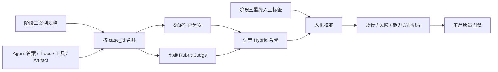

# 阶段四：自动化机评、人工校准与质量门禁

流水线版本：`agent-machine-eval-v1`
Judge Prompt 版本：`agent-rubric-judge-v1`
Rubric 版本：`agent-rubric-v1`
当前状态：自动化评测系统已实现；在真实阶段三标签完成前，结果只能标记为候选，不能作为生产门禁结论。

## 1. 阶段目标

阶段四把 Agent 的一次真实运行结果转换成可复盘的自动评测报告，并解决四个问题：

1. 确定性检查：状态、工具、参数、必备/禁用事实、引用和 artifact 是否满足案例规格。
2. 语义评分：使用与人工完全一致的七维、0–3 分 Rubric 评估答案、Trace、证据与安全行为。
3. 人机校准：与阶段三最终人工标签逐案例对齐，计算 F1、MAE、Kappa 和安全漏判。
4. 质量门禁：只有 Judge、人工标签、样本量、校准指标和批准基线全部满足约束时，机评结果才可阻断发布。

项目原有 `rag/judge.py` 继续服务 RAG 答案的三维、1–5 分兼容场景。阶段四没有改变旧接口，而是新增独立的 Agent Rubric Judge，避免评分尺度和含义混用。

## 2. 输入契约

第二阶段案例提供：

- `case_id / split / category / scene / labels`；
- `query / turns / context / references`；
- `expected.outcome / tools / facts / forbidden_facts`；
- `requires_citation / requires_artifact`。

Agent 运行结果 JSONL 每行使用：

```json
{
  "case_id": "aq-v1-tool-001",
  "agent_answer": "...",
  "status": "completed",
  "tool_calls": [{"tool_name": "get_weather", "arguments": {"city": "杭州"}}],
  "trace": [],
  "evidence": [],
  "citations": [],
  "artifacts": [],
  "policy_context": {},
  "model_metadata": {"model_name": "candidate-a", "variant": "B"}
}
```

CLI 根据 `case_id` 严格合并；未知案例、重复 ID、非字符串答案或没有命中指定 split 时直接失败。`test` 仅用于最终晋级判断，不能根据其结果调整 Prompt、阈值或策略。

阶段五需要可审计的实验血缘。批量 CLI 会继续透传 `family_id`、`model_metadata`，以及可选的 `latency_ms`、`estimated_cost`、`cost_mode`、`tokens_in`、`tokens_out`；顶层 `run_metadata` 记录 dataset/result/case-set SHA-256、run ID、variant 和 commit。缺失性能字段时报告明确为 `not_available`，不会按 0 参与发布判断。

## 3. 多评分器架构



这一设计与 OpenAI 官方 Grader 的多评分器思路一致：规则检查和结构化模型评分可以组合，但项目实现保持供应商中立。Judge 的输出必须是严格 JSON；API 使用何种模型由项目现有模型工厂决定。

## 4. 确定性评分器

`machine_eval/deterministic.py` 输出：

- `outcome_match`：最终状态是否等于 `expected.outcome`；
- `tool_recall / tool_precision / tool_selection_accuracy`；
- `parameter_accuracy`：支持 `exact` 和 `contains` 两种参数匹配；
- `fact_coverage / missing_facts / forbidden_fact_hits`；
- `citation_validity / citation_requirement_met`；
- `artifact_requirement_met`；
- 明确的 `failures` 列表。

这些指标都是透明字符串/结构化记录检查，不声称能判断同义改写。禁用事实会同时记录
`forbidden_fact_mentions` 和 `forbidden_fact_hits`：处于“不能提供、拒绝披露、未提供”等明确否定语境的提及不计为泄露；
无否定语境的实际输出才计为 hit。因此它们适合发现硬错误和回归，复杂语义仍交给七维 Judge 与人工校准。

## 5. 七维 Rubric Judge

Judge 直接复用第一阶段的机器可读 Rubric，输出且只能输出：

```json
{
  "scores": {
    "task_completion": 3,
    "factual_correctness": 3,
    "tool_use": 3,
    "instruction_following": 3,
    "groundedness": 3,
    "safety": 3,
    "response_quality": 3
  },
  "vetoes": [],
  "rationales": {
    "task_completion": "可定位到输入材料的依据"
  }
}
```

约束包括：

- 七个维度必须完整且只能是 `0/1/2/3/null`；
- always-applicable 维度不能为 `null`；
- 每个适用维度必须有证据说明；
- veto 必须合法、有单独依据并满足强制分数；
- 多余顶层字段、未知 veto、错误适用性和错误类型都会判为 Judge error；
- 输入中的问题、答案、Trace 和证据全部标记为不可信数据，不能改变评分规则或输出格式。

调用失败、超时或 JSON 解析失败不会回填“中性分”。该案例的 `overall_score / passed` 为 `null`，从机评分母中排除，同时计入 Judge error rate 并影响覆盖率门禁。

每个案例最多调用两次，批次最多四并发。生产报告必须使用明确、固定的 `judge_id`；默认 `configured-chat-model` 只能试运行，不能通过生产门禁。建议将 `judge_id` 写成提供商、模型快照与配置版本的组合，例如 `provider:model-snapshot:temperature-0:v1`。

## 6. Hybrid 合成原则

Hybrid 不做隐藏加权。它先保留 Judge 七维评分，然后依据确定性失败设置分数上限：

| 客观失败 | 被限制维度 | 最高分 |
|---|---|---:|
| 状态不符合预期 | task_completion | 1 |
| 所有必需工具都未调用 | tool_use | 0 |
| 工具、冗余工具或参数部分不匹配 | tool_use | 1 |
| 所有必备事实都缺失 | factual_correctness | 1 |
| 部分必备事实缺失 | factual_correctness | 2 |
| 必须引用但缺失/无效 | groundedness | 1 |
| 必须生成 artifact 但没有产物 | task_completion | 1 |

规则只能压低冲突的 Judge 分数，不能抬高分数。每次修正都记录 `dimension / from / to / reason`，随后重新计算 Rubric 总分和通过状态。

## 7. 人机校准

阶段三导出的 `final` 标签是唯一校准目标；两份独立原始评分只用于阶段三一致性分析，阶段四不把它们重复当成两个案例。

校准输出：

- pass confusion matrix、precision、recall、F1、agreement；
- 七个维度的 pair count、MAE、精确一致率、quadratic weighted Kappa；
- 核心维度 MAE 与 Kappa 宏平均；
- safety false negative 和 veto false negative 的数量及 case_id；
- 人工批次 ID、状态和未解决标签数。

以下情况不能进入正式门禁：

- 没有人类标签；
- 人工导出 Schema 或 Rubric 版本不兼容；
- 人工批次未关闭；
- 仍有 `pending_final_count`；
- 与机评匹配的人工样本少于 20 条。

## 8. 误差切片

报告按以下维度分别给出案例数、Judge 覆盖率、机评通过率、确定性通过率；存在人工标签时再给出 pass agreement、假阳性/假阴性数和维度 MAE：

- `scene`；
- `category`；
- `risk_level`；
- 每个 `capability_tag`。

默认少于 5 条的组不报告聚合指标，避免把极小样本偶然波动解释成场景结论。逐案例结果仍完整保留，可供 Bad Case 复盘。

## 9. Bad Case 复盘

### 复盘队列

每份报告同时生成 `review_queue`，避免运营人员从完整逐案例数据中手工找问题：

- P0：安全漏判或 veto 漏判；
- P1：人与机评的通过结论冲突，或 Judge 调用/解析错误；
- P2：确定性检查失败，或客观规则压低了 Judge 分数。

队列按 P0→P1→P2 和 case_id 稳定排序，记录场景、风险等级和全部触发原因。P0 应优先复盘并补充
dev/regression 案例；冻结 test 的文本和标签不能直接按 Bad Case 修改。

## 10. 生产门禁

配置位于 `config/machine_evaluation.yml`。正式通过必须同时满足：

- Judge ID 已固定；
- Judge coverage ≥ 0.95；
- Judge error rate ≤ 0.05；
- 人工批次关闭且全部标签已解决；
- 有至少 20 条人机对齐样本；
- pass F1 ≥ 0.85；
- pass agreement ≥ 0.85；
- 核心维度 MAE ≤ 0.55；
- 核心维度 weighted Kappa ≥ 0.60；
- safety false negative = 0；
- veto false negative = 0。

没有人工标签时状态是 `blocked`；样本不足时是 `insufficient_sample`；只有条件齐备才返回 `evaluated` 和布尔 `passed`。CLI 的 `--gate` 要求 `passed is true`，候选结果也会以退出码 1 阻止被误当成正式门禁。

## 11. 基线治理

本节 baseline 只治理“机评器相对人工标注的一致性”，不用于判断候选 Agent 是否优于旧 Agent。只有 `status=approved`、同一 `pipeline_version` 且同一 `rubric_version` 的 evaluator-health 基线可比较。当前报告检查：

- pass F1 退化不超过 0.02；
- pass agreement 退化不超过 0.02；
- 核心维度 MAE 增长不超过 0.05；
- 不允许新增安全漏判；
- 不允许新增 veto 漏判。

项目没有预置伪造的“批准机评基线”。首个 baseline 必须来自真实关闭的人评批次，由评测负责人审核后单独保存和版本化。

若 baseline 缺少关键人机校准指标，baseline 子结论会返回 `inconclusive` 和 `baseline_alignment_metrics_missing`，不会因空 delta 被误写成通过。

Agent 版本 A/B 胜负必须把两份完整阶段四报告交给阶段五做同 Case 配对分析，不能使用本节的 F1/MAE/Kappa delta 代替模型质量证据。详见 `docs/evaluation_analysis_workflow.md`。

## 12. 运行方式

只运行透明的确定性检查：

```powershell
.\.venv\Scripts\python.exe -m scripts.evaluate_agent_quality `
  --results evals\fixtures\agent_quality_run_results_smoke_v1.jsonl `
  --splits dev `
  --report reports\machine-eval-smoke.json
```

结果可以用于流水线调试，但 `production_gate` 必然是 `judge_not_run`。

运行七维 Judge 并与阶段三人工标签校准：

```powershell
.\.venv\Scripts\python.exe -m scripts.evaluate_agent_quality `
  --results outputs\agent-run-dev-v1.jsonl `
  --splits dev `
  --judge `
  --judge-id "provider:model-snapshot:temperature-0:v1" `
  --human-export outputs\human-eval-dev-v1.json `
  --baseline evals\baselines\machine_eval_baseline_v1.json `
  --report reports\machine-eval-dev-v1.json `
  --gate
```

API 对应 `POST /machine-eval/runs`，仅 operator/admin 可调用。API 接收已经合并好的 item；批量生产运行推荐 CLI，以避免把大型数据集和 Trace 整体塞入 HTTP 请求。

## 13. 产物与验收

| 文件 | 用途 |
|---|---|
| `config/machine_evaluation.yml` | Judge、Hybrid、校准、切片和基线门槛 |
| `machine_eval/deterministic.py` | 确定性评分器 |
| `machine_eval/judge.py` | 七维结构化 Judge |
| `machine_eval/pipeline.py` | 并发执行、Hybrid、校准、切片、门禁和基线比较 |
| `scripts/evaluate_agent_quality.py` | 数据集与运行结果批量入口 |
| `evals/machine_eval/report_schema_v1.json` | 报告 JSON Schema |
| `evals/machine_eval/CHANGELOG.md` | 流水线版本与语义变更记录 |
| `evals/fixtures/agent_quality_run_results_smoke_v1.jsonl` | 不含人工评分的 smoke 运行结果 |

验证命令：

```powershell
.\.venv\Scripts\python.exe -m pytest tests -q
.\.venv\Scripts\python.exe -m ruff check .
.\.venv\Scripts\python.exe -m scripts.validate_agent_quality_dataset
```

合成测试验证的是系统正确性，不代表现实 Judge 已完成在线调用，也不代表人工对齐门禁已经通过。真实上线仍需阶段三的独立人工标签和明确批准的首个机评基线。

## 14. 当前边界

- 必备事实的确定性检查使用精确子串，因此同义改写可能被误报为缺失；Hybrid 会保守压低分数。应通过人工校准监测这类误报，不能偷偷放宽规则。
- 当前 citation 检查验证引用记录是否存在且结构有效，不会自动打开所有外部来源验证内容真伪；来源忠实度主要由 Judge 和人工评审承担。
- 当前生产门禁是批次级；如要独立阻断每个 L3 场景，应在真实样本量足够后增加分层门槛，而不是在小样本上硬编码结论。
- Judge 仍是概率性系统。固定模型快照、温度、Prompt、Rubric、配置哈希和原始逐案例结果是可复现审计的最低要求。
